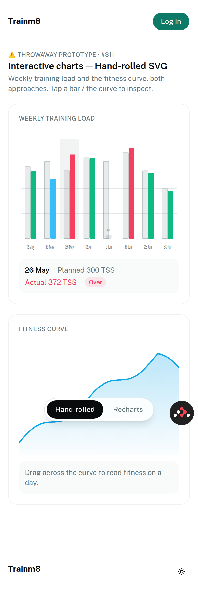
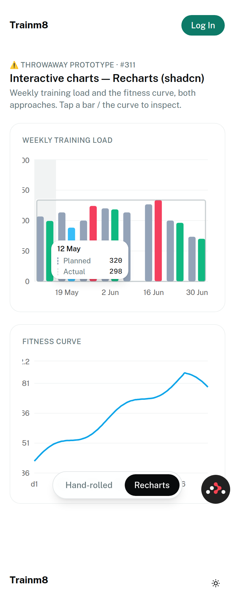
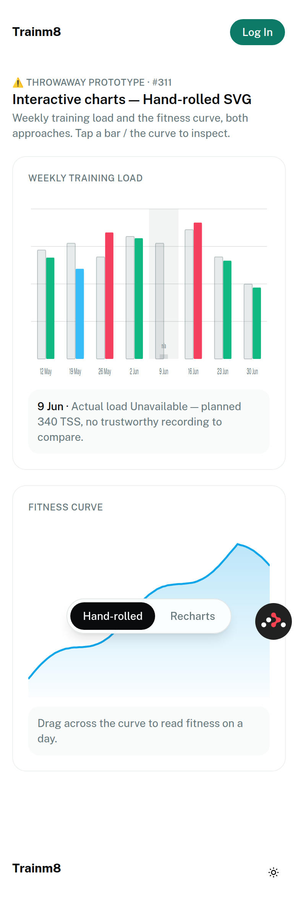
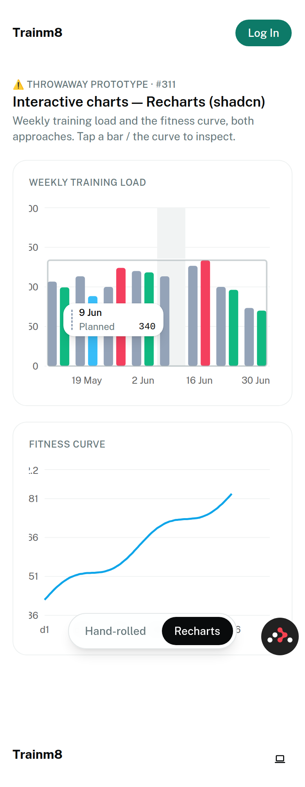

# Prototype: Recharts (shadcn `chart`) vs hand-rolled SVG — weekly-load bars + CTL curve

Feeds [#311](https://github.com/leskraas/trainm8/issues/311) under the map
[Wayfinder map: interactive shadcn-style charts & diagrams](https://github.com/leskraas/trainm8/issues/309).

**Posture:** this is the _prototype asset_ — it gathers first-hand evidence from a
running build so the approach can be **reacted to and picked** (HITL). It does **not**
pick. The pick + ADR is the act that resolves #311. Where the research ticket
[#310](https://github.com/leskraas/trainm8/issues/310) could only cite Recharts' _history_,
this measures **our** stack at 390×844.

## What was built

A single throwaway route, `app/routes/proto.charts.tsx` (public, synthetic data, no
persistence), renders **both** target charts **both ways**, switchable with
`?impl=recharts` / `?impl=handrolled`:

- the **weekly training-load bar chart** — TSS planned (ghost) vs actual, actual coloured
  by **Adherence Band** (`under`→sky, `on-target`→emerald, `over`→rose, matching
  `cockpit/shared.tsx`), with **one Unavailable week** (9 Jun: a plan exists, no
  trustworthy actual);
- the **CTL fitness curve** — area+line, extending the `fitness-journey.tsx` idiom.

Recharts side uses the real shadcn `chart` component (`npx shadcn add chart`, Recharts
**v3.8.0**) with `ChartContainer` / `ChartTooltip trigger="click"`. Run it:
`npm run dev` → `/proto/charts`.

## Verdict-relevant findings (measured, not cited)

### 1. SSR / first paint — hand-rolled wins clearly

Raw server HTML (`curl`, no JS):

| | Hand-rolled | Recharts (shadcn) |
|---|---|---|
| Bars painted server-side | **all** (`<rect>` per bar) | **none** (0 bar rects) |
| Curve painted server-side | **yes** (`<polyline>`+`<polygon>`) | **none** (0 `<path>`) |
| What _does_ SSR | full chart | axis/grid frame only, at the `initialDimension` 320×200 |

This repo's shadcn `chart.tsx` passes `initialDimension={{width:320,height:200}}` to
`ResponsiveContainer`, so Recharts SSRs a **sized axis frame** — better than the empty box
#310 feared — but the **data geometry (bars, line) still only appears after client
hydration**, then reflows to the real width. Hand-rolled renders the complete chart on the
first byte with no reflow. (Confirmed client-side: Recharts paints 15 bar rects only after
hydration.)

### 2. Mobile tap-to-inspect — both work; this **updates #310's pessimism**

`trigger="click"` on the Recharts `Tooltip` **does** show a tooltip on tap at 390px —
tapping the 26 May bar produced `26 May / Planned 300 / Actual 372`. The historical
"hover-only, tap broken" story (#310, issues #754/#444) is **not** what v3 + `click` does
here. So touch _inspect_ is a solved problem for **both** approaches.

The gap is **dismissal + anchoring**, and it cuts the other way:

| | Hand-rolled | Recharts |
|---|---|---|
| Show on tap | ✅ | ✅ (`trigger="click"`) |
| Tap **elsewhere to dismiss** | ✅ (re-tap toggles off) | ❌ — snaps to the **nearest** bar instead (never clears) |
| Tooltip placement | fixed panel **below** the chart, never covers bars | **floats over** the plot, obscures neighbouring bars (see screenshot) |
| Keyboard / AT | our `role="img"` + `aria-live` panel | Recharts `accessibilityLayer` (`role="application"`) |

Dismissal-and-anchoring is exactly the tap contract #312 must nail — and it's a
**hand-built obligation with Recharts too**, not a default.

### 3. Unavailable Metric (ADR-0008) — neither library gives it; hand-rolled makes it cheap

- **Hand-rolled:** the 9 Jun week paints **no bar** — a small `n/a` tick + the honest
  inspect line _"Actual load Unavailable — planned 340 TSS, no trustworthy recording to
  compare."_
- **Recharts:** a `null` actual draws **no bar** (good — no zero-bar fabrication) but says
  **nothing** about _why_; tapping the week silently shows `Planned 340` only. A user can't
  tell "unavailable" from "I mis-tapped." An explicit Unavailable marker/label is **our
  layer regardless of library** — as #310 predicted.

### 4. Bundle cost — real number from our build

The `/proto/charts` client chunk (Recharts + shadcn chart + both chart types):
**371 KB raw / ~111 KB gzip**, and it is the **only** chunk that imports `recharts` — React
Router route-splits it, so it loads **lazily on the chart route**, not in the app entry
bundle. Higher than #310's ~50 KB estimate because this pulls in **two** chart families
(`BarChart` + `LineChart` + cartesian axes/grid); a single family would be less. Hand-rolled
adds **~0 KB** runtime.

### 5. Look/feel & effort

- **Recharts:** axes, gridlines, tooltip chrome, legend, animation come **for free** and
  read "like shadcn"; theming rides CSS vars (`--color-*`) into our tokens cleanly. Cost:
  fighting its defaults for honesty + tap dismissal + SSR, and per-chart-type it's still
  config. Y-axis label clipping needed margin tuning even in the prototype.
- **Hand-rolled:** total control over honesty, tap model, and SSR; ~0 deps; **but** every
  chart type (bars, curve, and later the dense multi-series Telemetry Overlay) is bespoke
  geometry, axis, and tick work we write and maintain ourselves.

## Screenshots (390×844)

| Hand-rolled | Recharts |
|---|---|
|  |  |
|  |  |

## The decision this sets up (for the HITL pick, not made here)

The contest is genuinely close and comes down to a values trade, which is why it's the
operator's call:

- **Recharts** buys shadcn-idiomatic polish + free axes/tooltip/legend, at the cost of a
  ~111 KB-gzip lazy chunk, a hydration reflow (no SSR data), and hand-built honesty + tap
  dismissal on top of the library.
- **Hand-rolled** keeps the app's current properties — SSR-native, ~0 KB, honesty and
  tap-model fully ours — at the cost of writing every chart type by hand, the Telemetry
  Overlay being the hard one.

Whichever wins, three things are **our** work either way and belong to #312's contract:
the **Unavailable** marker, **tap-to-dismiss**, and the **a11y philosophy**
(`role="img"`+text vs Recharts `role="application"`).

_Measured on branch `claude/wayfinder-309-changes-n3bjb9`; Recharts v3.8.0; React 19.2,
React Router 7.13, Vite 7, Tailwind v4, shadcn `base-rhea`._
