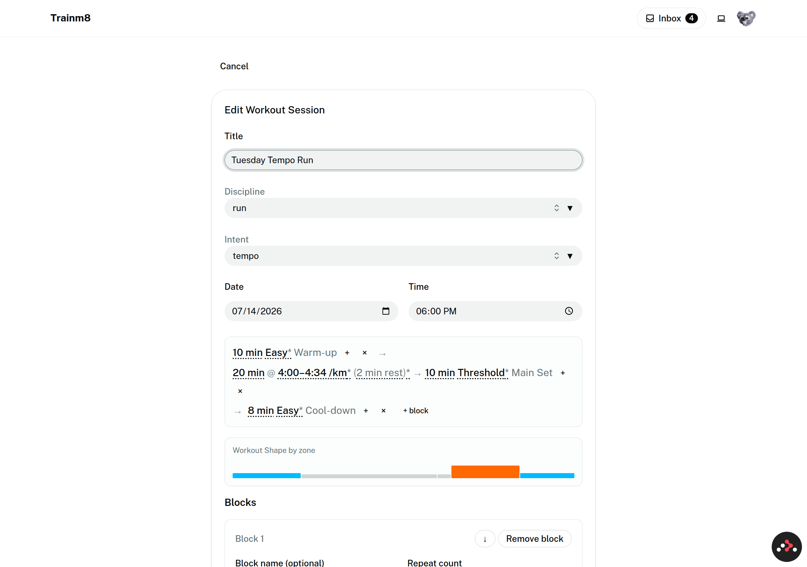

# #241 — Craft punch-list: what reads as "rushed" in the current workout editor

Asset for [wayfinder ticket #241](https://github.com/leskraas/trainm8/issues/241), part of
[map #234](https://github.com/leskraas/trainm8/issues/234).

**Method.** Ran the app locally (seeded dev DB, `MOCKS=true`), logged in as the seeded
athlete, and drove all four surfaces that render the editor today: **create**
(`/training/sessions/new`), **edit** (`/training/upcoming/:id/edit`, seeded "Tuesday
Tempo Run" — 3 blocks / 5 steps), the **detail view** (`/training/sessions/:id`), and
both create + edit at a **390 px mobile viewport**. Screenshots live in
[`241-shots/`](241-shots/) and are referenced per item.

Every item is sorted into one of two buckets, per the ticket:

- **A — Dissolved by option A**: disappears mechanically once the fieldset form is
  deleted and the Token Sentence is the sole authoring surface.
- **B — Still on us**: a craft defect in the surviving Token Sentence editor, shape
  preview, or page frame that the redesign must actively fix.

Where a "still on us" item is already owned by an open design ticket, the owner is
named — this list is the evidence those tickets design against.

---

## The headline, in one screenshot

The edit page states the same workout **three times in a row**: the token sentence,
the zone strip, and (below the fold) a fieldset form that runs on for another five
screens. The full-page capture ([07](241-shots/07-edit-fullpage.png)) is **~7,400 px
tall on desktop** and **~7,900 px on mobile**
([11](241-shots/11-edit-mobile-fullpage.png)) — for a five-step tempo run.

---

## Bucket A — Dissolved by deleting the fieldset form

**A1 — Triple statement of the workout.** Sentence + shape strip + full Blocks form
stacked on both create and edit ([02](241-shots/02-create-fullpage.png),
[07](241-shots/07-edit-fullpage.png)). The athlete edits in one surface and must
visually reconcile it against two others.

**A2 — The fieldset column itself.** Per-block "Block name (optional)" / "Repeat
count" grids, per-step `Step N` legends cutting through fieldset borders, full-width
Notes textareas with placeholder prose, and per-step Kind / Discipline / Intensity /
Duration / Distance controls — five screens of raw form for a workout the sentence
states in one line ([07](241-shots/07-edit-fullpage.png)).

**A3 — Raw reorder/remove chrome.** Bare `↑` / `↓` circle buttons plus a text
"Remove" pill on every step, and `↓` + "Remove block" per block
([05](241-shots/05-create-two-steps-fullpage.png)) — the operator's named example of
"rushed". Gone with the form; reorder moves to the sentence's ⠿ drag / ⋮ menu model
(#236).

**A4 — The scroll.** ~7,400 px desktop / ~7,900 px mobile edit page
([07](241-shots/07-edit-fullpage.png), [11](241-shots/11-edit-mobile-fullpage.png)).
Deleting the form collapses the page to sentence + preview + session header.

**A5 — Blank and "None" selects in fieldsets.** Cardio steps render a Discipline
select with an empty selected value (a grey control displaying nothing) and an
Intensity select stating "None" ([02](241-shots/02-create-fullpage.png)). Absent
facets become #243's sentence-side problem instead.

**A6 — Duplicate add affordances.** `+` / `+ block` on the sentence *and*
"+ Add Step" / "+ Add Block" buttons in the form do the same job two ways
([03](241-shots/03-create-with-token-fullpage.png)).

**A7 — Sentence edits don't echo into the form's inputs visibly.** Authoring "30 min"
via the fieldset materialises a token, but a second empty step added in the form
renders nothing on the line ([05](241-shots/05-create-two-steps-fullpage.png)) — the
two surfaces silently disagree about how many steps exist. Single surface, no
disagreement.

---

## Bucket B — Still on us

These are the craft requirements the surviving editor must meet. Owners in brackets.

**B1 — Sentence chrome reads as typographic debris.** Bare `+`, `×`, `→` glyphs
float between tokens with no visible hit area, inconsistent gaps, and no visual
rank — `+ block` is loose text at the end of the line
([08](241-shots/08-edit-viewport.png)). #236 has since replaced this model with
always-visible ⠿ / ⋮ chrome; the craft requirement it inherits: **every interactive
mark on the line must look interactive, and chrome must be visually subordinate to
notation.** [#236 done, #242 styles it]

**B2 — Wrapping orphans chrome from its step.** On desktop edit, the Main Set's `×`
wraps alone onto its own line; on mobile the sentence breaks mid-step with arrows
stranded at line ends ([08](241-shots/08-edit-viewport.png),
[11](241-shots/11-edit-mobile-fullpage.png)). #236's "one block per line under
640 px" rule addresses the mobile case; the requirement stands generally: **a step
and its chrome are an unbreakable unit.** [#242]

**B3 — Token styling is dotted underline + asterisk litter.** Tokens are plain text
with a dotted underline, and unresolved-zone markers render as trailing asterisks
(`Easy*`, `(2 min rest)*`) that nothing on the page explains
([08](241-shots/08-edit-viewport.png)). The artifact's chip language (states for
default / selected / editing / unresolved) doesn't exist yet. **Design real token
states; give "unresolved" a legible treatment, not a footnote mark.** [#242]

**B4 — Popovers are unstyled and mis-anchored.** The Duration popover is a floating
white card with a heading and a bare `−  30 min  +` stepper — no direct text entry,
no pointer to its token, and it renders far from the token it edits, covering
unrelated content ([04](241-shots/04-token-popover.png),
[12](241-shots/12-intensity-popover.png)). The pace popover is the best of them and
still stacks raw selects/inputs ([13](241-shots/13-pace-popover.png)). **Anchor
popovers to their token, allow keyboard entry, and give them the artifact's popover
treatment.** [#242, keyboard model #240]

**B5 — Internal vocabulary leaks to the athlete.** The Intensity popover's select
displays the literal enum value **`zoneLabel`**, above a dev-note line **"Recipe:
daniels-pace-5"** ([12](241-shots/12-intensity-popover.png)); mobile truncates it to
`zoneL…` ([11](241-shots/11-edit-mobile-fullpage.png)). It also says "Intensity"
twice (popover title + field label). **All athlete-facing copy must be human-domain
words; recipes/enum names never render.** [#242]

**B6 — Every select renders two dropdown indicators.** Each `SelectField` trigger
shows a `⇅` icon *and* a `▼` glyph side by side (all screenshots; see
`app/components/ui/select.tsx`). Selects survive inside popovers and the sheet, so
this outlives the fieldsets. **One indicator.** [#242]

**B7 — The shape strip misleads and has seams.** The strip renders hairline gaps
between segments, always fills the container width regardless of total duration, and
paints a **solid green full-width bar for a workout with a single empty step** — the
create page's "nothing authored yet" state looks like a completed easy session
([02](241-shots/02-create-fullpage.png),
[06](241-shots/06-sentence-add-step.png)). Unresolved zones show as pale grey with
no key ([08](241-shots/08-edit-viewport.png)). **The preview must be honest about
emptiness and unresolved zones.** [#239 decides fidelity; #242 styles it]

**B8 — The session header reads as a separate, older app.** Title / Discipline /
Intent / Date / Time are grey filled selects and native date/time inputs whose resting
state looks disabled; their label treatment differs from the labels twenty pixels
below them ([02](241-shots/02-create-fullpage.png)). The corrected editor keeps this
zone, so it must be designed with the sentence, **not left as the leftover top of the
old form** — otherwise the page still reads assembled. [#242]

**B9 — Detail view narrates itself and duplicates affordances.** The structure card
shows the live sentence plus a permanent "Save changes" button (even with no edits)
and helper prose — "Tap a token to adjust it, then save — no need to open the edit
page" — while an "Edit session" button sits in the same viewport
([09](241-shots/09-detail-fullpage.png)). **A considered surface doesn't need a
sentence of instructions; save should be state-aware; one editing entry point.**
[#246 decides the model; #242 the treatment]

**B10 — Mobile clips values inside controls.** Min/max pace inputs display `4:0` /
`4:3`, selects truncate (`thres…`), placeholders clip mid-unit
([11](241-shots/11-edit-mobile-fullpage.png)). The popovers/sheet that survive must
be width-audited at 390 px. [#240]

**B11 — The empty state is three contradictory statements of "nothing".** A new
session shows an empty sentence box containing only `+  + block`, a full-width green
shape bar, and a Step 1 fieldset ([01](241-shots/01-create-viewport.png)). After
option A the sentence + preview remain, so the pair still needs a designed empty
state — and the preview's part of it is B7. [#245, #239]

---

## Reading of the two buckets

Roughly half the "rushed" impression (A1–A7) is the leftover form and dissolves with
option A, which confirms the primary-surface decision. The other half (B1–B11) lives
in the Token Sentence editor and preview that *survive* — chrome-as-debris, unstyled
popovers, leaking vocabulary, dishonest preview, and an undesigned page frame. That
matches the operator's verdict that the new editor "misses a lot and doesn't feel
good": deleting the fieldsets is necessary but nowhere near sufficient. B1–B11 are
the concrete craft requirements #242 must set direction for, with #239, #240, #243,
#245 and #246 picking up their named slices.
